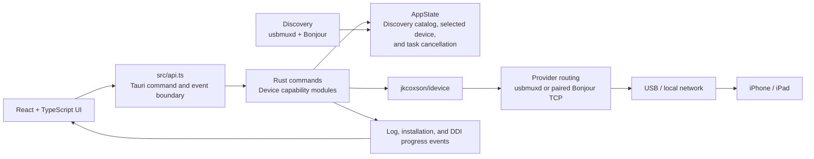

# idevice desktop Project Overview

> Last updated: 2026-07-25
> Current release: 0.0.1 Developer Preview; next patch in development

## 1. Project Positioning

idevice desktop is a macOS developer tool for iPhone and iPad development and testing. It presents device discovery, pairing, information, file management, application management, crash reports, live logs, and developer capabilities through a graphical interface. Its purpose is to lower the barrier to using usbmuxd, Lockdown, AFC, CoreDevice/DVT, and related low-level services directly.

The long-term goal is to make the device capabilities currently exposed through `idevice-tools` usable through a GUI. The GUI is more than a command launcher: it must handle device and parameter selection, prerequisites, input validation, progress, understandable errors, destructive-action confirmation, and cleanup of long-running tasks.

The current phase focuses on a macOS MVP that can connect to real devices. High-frequency developer workflows such as logs, IPA management, DDI, JIT, screenshots, and location simulation take priority. A browser demo mode remains available for UI development and product discussion without a device. See [`CAPABILITY_MATRIX.md`](CAPABILITY_MATRIX.md) for detailed coverage.

### Product Principles

- Users should not need to memorize commands, parameters, ports, or low-level service names.
- Advanced parameters should be progressively disclosed rather than permanently omitted for the sake of simplicity.
- Output should be structured and support search, filtering, copying, and raw-data inspection where useful.
- Long-running tasks must expose status and support safe stopping, device disconnects, and page-exit cleanup.
- Installation, uninstallation, deletion, activation, and restore operations must use risk-appropriate validation and confirmation.
- New or changed upstream commands must be assessed in the GUI coverage matrix instead of being silently missed.

### Target Users

- Developers who inspect and manage iOS or iPadOS test devices
- Testers who install IPAs, read logs, enable JIT, or simulate location
- Advanced users who want graphical access to the `idevice` ecosystem

### Current Scope

- The initial release supports macOS only; Windows and Linux are outside the initial commitment.
- USB and Bonjour device discovery, initial USB pairing, and direct TCP Lockdown fallback for already-paired devices
- Developer workflows as the primary product focus, supported by foundational device-management features
- Legacy developer services for iOS 16 and earlier, plus CoreDevice/RSD paths for iOS 17 and later

### Current Non-Goals

- Replacing the complete Finder or iTunes backup, restore, and system-update experience
- Claiming validated compatibility with every iOS version and device model
- Supporting Windows or Linux in the initial release
- Multi-window workflows, user accounts, cloud sync, or remote fleet management

## 2. Product Modes

| Mode | Start command | Data source | Purpose |
| --- | --- | --- | --- |
| Browser demo | `npm run dev` | Mock data in `src/data.ts` | UI preview, interaction design, and development without a device |
| Tauri desktop | `npm run desktop:dev` | Real devices through the Rust backend | Device operations and integration testing |

The frontend detects the Tauri runtime and selects the appropriate mode automatically. Demo-mode results must never be treated as real-device test results.

## 3. Feature Map

| Module | User capabilities | Primary services |
| --- | --- | --- |
| Device connection | Discover through usbmuxd and Bonjour, merge transports, monitor, select, pair, unpair, and disconnect devices | usbmuxd, mDNS/DNS-SD, Lockdown |
| Overview | Device details, battery, storage, and screenshots | Lockdown, AFC, Screenshot/DVT |
| Diagnostics | Battery, MobileGestalt, IORegistry, NAND, and Wi-Fi data | Diagnostics Relay |
| Files | Browse AFC and file-sharing app containers; upload, download, create directories, and remove recursively | AFC, House Arrest |
| Apps | List user applications and icons; install and uninstall IPAs; show installation progress | Installation Proxy, SpringBoardServices |
| Crash Reports | List, filter, preview, and export device reports | CrashReportCopyMobile, AFC |
| Logs | Stream, filter, pause, and clear structured logs | OS Trace and syslog services |
| Debug Tools | Manage Developer Mode and DDI; launch applications; maintain JIT sessions | AMFI, Image Mounter, CoreDevice, DVT, debug proxy |
| Location | Choose presets or map coordinates and start or stop location simulation | DVT/RSD or Lockdown location services |

## 4. Technical Architecture



### Frontend

- React 18, TypeScript, and Vite
- `src/App.tsx` holds the application shell: device selection, navigation, theme state, and page routing.
- `src/pages/` contains one module per feature page, and `src/components/` holds the shell and shared presentation components.
- `src/lib/` holds byte and value formatting plus the conversions between backend responses and view models.
- `src/types.ts` defines the shell-level union types shared across pages.
- `src/api.ts` defines the Tauri commands, events, and cross-boundary data types.
- `src/data.ts` supplies browser-demo data.
- `src/styles.css` provides Clean, Terminal, and Apple visual themes plus light and dark appearances.
- Leaflet and OpenStreetMap provide interactive location selection.

### Desktop Backend

- Tauri 2, Rust 2024 edition, and Tokio
- `src-tauri/src/commands/` separates device, overview, diagnostics, files, apps, crash reports, logs, developer, location, and screenshot commands.
- `AppState` stores the unified discovery catalog and selected device, and uses cancellation tokens for monitoring, logs, JIT, location, and other long-running tasks.
- `discovery.rs` merges usbmuxd, `_apple-mobdev2._tcp`, `_remotepairing._tcp`, and manual RemotePairing observations. USB is preferred; Wi-Fi MAC address, UDID, hostname, and address overlap are used to reconcile transports.
- A known paired device remains selectable through direct Bonjour TCP Lockdown if its usbmuxd observation disappears. Unidentified mobdev2 and manual RemotePairing records remain visible for association, while unidentifiable RemotePairing-only records are hidden.
- `provider.rs` prefers usbmuxd and falls back to a paired Bonjour TCP provider using the selected device's mobdev2 addresses.
- Crash reports use the Lockdown CrashReportCopyMobile service over USB. Network access uses the RSD `com.apple.crashreportcopymobile.shim.remote` service through RemotePairing on iOS 17.0–17.3 or CoreDeviceProxy on iOS 17.4+.
- Legacy location simulation reconnects to the Lockdown developer service before clearing because iOS 14.2 closes the connection after accepting a set command.
- `device_version.rs` selects the developer-service transport based on iOS version.
- `tunnel.rs` implements RemotePairing and RSD software tunnels for iOS 17.0 through 17.3 and accepts the selected device's resolved endpoint to avoid cross-device routing.

### iOS Developer-Service Generations

| System version | Transport | DDI approach |
| --- | --- | --- |
| iOS 16 and earlier | Legacy Lockdown developer services | Matching `DeveloperDiskImage.dmg` and `.signature` |
| iOS 17.0–17.3.x | RemotePairing and RSD/DVT | Personalized DDI |
| iOS 17.4 and later | Lockdown CoreDeviceProxy and RSD/DVT | Personalized DDI, with automatic mounting available on macOS |

The two DDI generations come from different places, which matters when mounting through Choose files:

| | iOS 16 and earlier | iOS 17 and later |
| --- | --- | --- |
| Source | Per-version `DeveloperDiskImage.dmg` archives, which Xcode no longer ships | `/Library/Developer/DeveloperDiskImages/iOS_DDI/`, installed with Xcode |
| Files | The image and its `.signature` | The image, `Restore/BuildManifest.plist`, and the matching `Restore/Firmware/<image>.trustcache` |
| Mounting | `mount_developer` with the signature | Personalized mounting, which requests a TSS signature for the device |

The personalized bundle contains several images with a trustcache each; an image must be paired with its own trustcache. `pymobiledevice3` is a useful reference for this flow.

JIT differs between generations beyond transport. iOS 17 and later launch the application through the DVT instruments server and attach by pid. On iOS 16 and earlier that service accepts `StartService` but never responds on the socket it returns, so JIT attaches by process name to an application the user has already opened, and never terminates it.

## 5. Repository Structure

```text
.
├── docs/                    # Project, progress, and capability documentation
├── idevice/                 # Original design handoff bundle, used only as a visual reference
├── src/                     # React frontend
│   ├── App.tsx              # Application shell, navigation, and page routing
│   ├── pages/               # One module per feature page
│   ├── components/          # Shell and shared presentation components
│   ├── lib/                 # Formatting and backend-to-view-model conversion
│   ├── types.ts             # Shell-level shared types
│   ├── api.ts               # Tauri API and event boundary
│   ├── data.ts              # Browser demo data
│   └── styles.css           # Global visual styles
├── src-tauri/               # Tauri and Rust backend
│   ├── src/commands/        # Device capability commands
│   ├── src/discovery.rs      # Unified usbmuxd and Bonjour device catalog
│   ├── src/state.rs         # Application state and task lifecycle
│   ├── src/tunnel.rs        # RemotePairing and RSD tunnels
│   └── Cargo.toml
├── build.sh                 # Desktop build entry point
└── package.json
```

## 6. Local Development

### Requirements

- Node.js and npm
- A Rust toolchain
- The platform development dependencies required by Tauri 2
- An accessible usbmuxd service
- An iPhone or iPad and a data cable for real-device work, including approval of the device trust prompt

### Common Commands

```bash
npm install
npm run dev
npm run desktop:dev
npm run build
cargo check --manifest-path src-tauri/Cargo.toml
npm run desktop:build
```

`./build.sh` also builds the desktop application. By default, the macOS `.app` output is written below `src-tauri/target/release/bundle/`.

## 7. Engineering Conventions

- `src/api.ts` is the frontend-backend contract. Any Rust response-type change must be reflected in its TypeScript counterpart.
- Switching or disconnecting a device must cancel tasks that depend on the previous device so log, JIT, and location sessions cannot leak.
- Features that use iOS developer services must select a transport through `device_version.rs` instead of assuming one protocol for every system version.
- The upstream `idevice` dependency is pinned to `8eed181f39a16ea70380ec8c3cff6bed07a1ef69`. Upgrades require dedicated API and real-device validation.
- Browser demo data and real desktop data must remain clearly separated.
- Destructive operations such as file removal, application uninstallation, and unpairing must provide clear confirmation and error feedback.

## 8. Known Technical Risks

- Real-device behavior depends on the iOS version, Developer Mode, DDI state, pairing records, USB or network transport, and changes to private Apple protocols.
- RemotePairing on iOS 17.0 through 17.3 depends on Bonjour discovery and a locally stored pairing file, making it sensitive to network conditions.
- Direct Bonjour TCP Lockdown and RemotePairing/RSD crash-report access pass on the validated iOS 17.0 device. The corresponding iOS 17.4+ CoreDeviceProxy crash-report path is integrated but not yet verified on hardware.
- On iOS 14.2, USB discovery and routing, nested crash-report export, legacy screenshot and location services, OS Trace, five diagnostic request paths, AFC file round trips, and user-app listing with icons pass at the backend. Frontend interaction remains a separate acceptance layer.
- The frontend is split into a shell, page modules, shared components, and helpers, but still has no component tests, so refactors rely on the type checker and the production build alone.
- The project does not yet have systematic frontend tests, Rust integration tests, or automated real-device compatibility tests.
- Map tiles come from the online OpenStreetMap service and will not work offline or on restricted networks.
- The Tauri CSP is currently `null` and must be reviewed and tightened before signed or general-user distribution.

## 9. Documentation Rules

- Update this document whenever the product scope, architecture, or engineering conventions change.
- Update `docs/PROGRESS.md` after each development cycle with the date, verification results, active work, and next steps.
- Keep "integrated in code," "build passed," and "verified on a real device" as separate statuses.

## 10. Decision Log

| Date | Decision | Impact |
| --- | --- | --- |
| 2026-07-22 | Position the product as an iPhone and iPad developer tool | Prioritize JIT, DDI, logs, IPA workflows, screenshots, and location over general content management |
| 2026-07-22 | Support macOS only for the initial release | Focus builds, signing, notarization, test coverage, and documentation on macOS |
| 2026-07-22 | Make GUI coverage of `idevice-tools` the long-term product goal | Track coverage and implement capabilities by frequency, complexity, and risk |
| 2026-07-22 | Credit `jkcoxson/idevice` and retain its MIT license text for GitHub publication | Add a README acknowledgement and third-party license notice |
| 2026-07-22 | License idevice desktop under the MIT License | Permit broad use and contribution while retaining copyright and license notices |
| 2026-07-25 | Publish 0.0.1 as an unsigned Apple Silicon Developer Preview | Distribute through GitHub prerelease with Gatekeeper and compatibility warnings |
