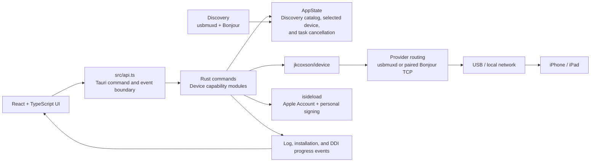

# idevice_desktop Project Overview

> Last updated: 2026-08-30
> Current release: 0.0.2 Developer Preview
> Development version: 0.0.4

## 1. Project Positioning

idevice_desktop is a macOS developer tool for iPhone and iPad development and testing. It presents device discovery, pairing, information, file management, application management, crash reports, live logs, and developer capabilities through a graphical interface. Its purpose is to lower the barrier to using usbmuxd, Lockdown, AFC, CoreDevice/DVT, and related low-level services directly.

The long-term goal is to make the device capabilities currently exposed through `idevice-tools` usable through a GUI. The GUI is more than a command launcher: it must handle device and parameter selection, prerequisites, input validation, progress, understandable errors, destructive-action confirmation, and cleanup of long-running tasks.

The current phase focuses on a macOS MVP that can connect to real devices. High-frequency developer workflows such as logs, IPA management, DDI, JIT, screenshots, and location simulation take priority. A browser demo mode remains available for UI development and product discussion without a device. See [`CAPABILITY_MATRIX.md`](CAPABILITY_MATRIX.md) for detailed coverage.

### Product Principles

- Users should not need to memorize commands, parameters, ports, or low-level service names.
- Advanced parameters should be progressively disclosed rather than permanently omitted for the sake of simplicity.
- Output should be structured and support search, filtering, copying, and raw-data inspection where useful.
- Long-running tasks must expose status and support safe stopping, device disconnects, and page-exit cleanup.
- Installation, uninstallation, deletion, activation, and restore operations must use risk-appropriate validation and confirmation.
- New or changed upstream commands must be assessed in the GUI coverage matrix instead of being silently missed.

### Target Users

- Developers who inspect and manage iOS or iPadOS test devices
- Testers who install IPAs, read logs, enable JIT, or simulate location
- Advanced users who want graphical access to the `idevice` ecosystem

### Current Scope

- The initial release supports macOS only; Windows and Linux are outside the initial commitment.
- USB and Bonjour device discovery, initial USB pairing, and direct TCP Lockdown fallback for already-paired devices
- Developer workflows as the primary product focus, supported by foundational device-management features
- Legacy developer services for iOS 16 and earlier, plus CoreDevice/RSD paths for iOS 17 and later

### Supported Versions

| | Requirement |
| --- | --- |
| macOS | 11.0 or later, Apple Silicon only |
| iOS, verified | 14.2, 17.0, and 26.5 — one device per developer-service generation |
| iOS, covered by generation | 15 and 16, which share the Legacy branch with 14.2 |
| iOS, expected but unverified | 12.0 and later |

Verification is organized by developer-service generation rather than by iOS release, because `device_version.rs` is what decides how a device is driven. iOS 14, 15, and 16 all satisfy `major < 17` and therefore select the same Legacy transport and DDI approach, so the verified 14.2 device covers that branch and 15 and 16 are not tracked as separate gaps.

The exception is Developer Mode, which Apple introduced in iOS 16. On iOS 14 and 15 the AMFI service is absent, `AmfiClient::connect` fails, and the status degrades to `None` — correct for those versions, but it means no verified device exercises the iOS 16 enable-and-reboot flow.

macOS 11.0 is the floor because releases are built for `arm64`, and Apple Silicon starts there. It matches what the binary itself requires, so the bundle no longer advertises a lower version than it can run on.

Automatic DDI mounting for iOS 17 and later shells out to `devicectl`, which needs Xcode 15 and therefore macOS 13.5. That is a requirement of one feature, not of the application.

Mounting has no interface. `ddi_ensure` runs once per device selection, checks whether an image is already mounted, and mounts one if not. iOS 17 and later personalize the image on the device, so nothing has to be supplied — Xcode's `/Library/Developer/DeveloperDiskImages/iOS_DDI` is one image set covering every product type, which is why that generation needs no per-version handling.

iOS 16 and earlier mount a prebuilt image instead, and `legacy_ddi.rs` uses **one** pinned image for all of them rather than matching the device's release. That is a deliberate trade. Apple signs an image per release, and mounting a mismatched one is not guaranteed to work — see the known risk below — but the alternative makes behaviour depend on which Xcode a given Mac happens to have installed, which is not reproducible across machines or in a bug report.

The image is **not** redistributed with the application. Apple's disk images are proprietary and the community mirrors that host them carry no license, so shipping one inside the bundle would put unlicensed, Apple-owned material in the release itself. Instead `ddi_download` fetches it once, only when the user asks, from a commit-pinned URL, checks both files against a pinned SHA-256 and byte length, and installs them atomically into the user's own `~/Library/Developer/DeveloperDiskImages/<version>`. That directory and a matching Xcode `DeviceSupport` folder are both read on startup, so a Mac that already has the file never downloads it. `ddi_ensure` reports a missing image as the error kind `ddi-missing`, which is what makes the Developer page offer the download instead of a failure.

`cargo run --example verify_legacy_ddi` reports the install state, and `-- --install` exercises the production download path with no device attached.

| | iOS 16 and earlier | iOS 17 and later |
| --- | --- | --- |
| Image | one pinned `DeveloperDiskImage.dmg` (currently 14.2) | personalized on the device |
| Source | downloaded on request, or an existing Xcode copy | Xcode's `iOS_DDI`, via `devicectl` |
| Network | once per Mac, user-initiated | never |

**Known risk.** The pinned image is built for iOS 14.2, and iOS 14.2 is verified: an iPhone10,1 mounted it automatically on selection. The signature is over the image rather than bound to the device's release, so the mount itself is expected to succeed on other Legacy releases, but the developer tools inside the image are compiled for 14.x. An iOS 15 or 16 device may mount it and still have a developer service behave incorrectly. Only iOS 14.2 is covered until each release is verified on hardware; the choice of a single image is recorded here so a failure on 15 or 16 is read as this trade-off rather than as a transport defect.

The unverified iOS floor is a statement about which code paths exist, not a compatibility claim. Nothing below 14.2 has been run. Systems old enough to need pre-TLS 1.2 handshakes are expected to fail outright, because the project builds `idevice` against rustls, which does not implement them.

### Current Non-Goals

- Replacing the complete Finder or iTunes backup, restore, and system-update experience
- Claiming validated compatibility with every iOS version and device model
- Supporting Windows or Linux in the initial release
- Multi-window workflows, user accounts, cloud sync, or remote fleet management

## 2. Product Modes

| Mode | Start command | Data source | Purpose |
| --- | --- | --- | --- |
| Browser demo | `npm run dev` | Mock data in `src/data.ts` | UI preview, interaction design, and development without a device |
| Tauri desktop | `npm run desktop:dev` | Real devices through the Rust backend | Device operations and integration testing |

The frontend detects the Tauri runtime and selects the appropriate mode automatically. Demo-mode results must never be treated as real-device test results.

## 3. Feature Map

| Module | User capabilities | Primary services |
| --- | --- | --- |
| Device connection | Discover through usbmuxd and Bonjour, merge transports, monitor, select, pair, unpair, and disconnect devices | usbmuxd, mDNS/DNS-SD, Lockdown |
| Overview | Device details, battery, storage, and screenshots | Lockdown, AFC, Screenshot/DVT |
| Diagnostics | Battery, MobileGestalt, IORegistry, NAND, and Wi-Fi data | Diagnostics Relay |
| Files | Browse AFC and file-sharing app containers; upload, download, create directories, and remove recursively | AFC, House Arrest |
| Apps | List user applications and icons; install and uninstall IPAs; show installation progress | Installation Proxy, SpringBoardServices |
| Personal Sign | Sign in with an Apple Account and 2FA to register the selected device, acquire development assets, sign/export/install an IPA; or use a local profile and matching Keychain identity | `isideload`, Apple developer services, macOS Keychain, `codesign`, Installation Proxy |
| Crash Reports | List, filter, preview, and export device reports | CrashReportCopyMobile, AFC |
| Logs | Stream, filter, pause, and clear structured logs | OS Trace and syslog services |
| Debug Tools | Manage Developer Mode and DDI; launch applications; maintain JIT sessions | AMFI, Image Mounter, CoreDevice, DVT, debug proxy |
| Location | Choose presets or map coordinates and start or stop location simulation | DVT/RSD or Lockdown location services |

## 4. Technical Architecture


```mermaid
flowchart LR
    UI["React + TypeScript UI"] --> API["src/api.ts\nTauri command and event boundary"]
    API --> CMD["Rust commands\nDevice capability modules"]
    CMD --> STATE["AppState\nDiscovery catalog, selected device,\nand task cancellation"]
    DISC["Discovery\nusbmuxd + Bonjour"] --> STATE
    CMD --> LIB["jkcoxson/idevice"]
    CMD --> SIGN["isideload\nApple Account + personal signing"]
    LIB --> ROUTE["Provider routing\nusbmuxd or paired Bonjour TCP"]
    ROUTE --> MUX["USB / local network"]
    MUX --> IOS["iPhone / iPad"]
    CMD --> EVT["Log, installation, and DDI progress events"]
    EVT --> UI
```

### Frontend

- React 18, TypeScript, and Vite
- `src/App.tsx` holds the application shell: device selection, navigation, and page routing.
- `src/pages/` contains one module per feature page, and `src/components/` holds the shell and shared presentation components.
- `src/lib/` holds byte and value formatting, the conversions between backend responses and view models, and the shared hooks: `useDeviceSession` owns discovery, selection, pairing and the background DDI mount; `useDeviceEvents` owns the subscribe-start-stop lifecycle of a streaming page; `useDeviceTask` wraps the demo-mode guard and error reporting; `useInterval` and `useFileDrop` cover polling and native drops.
- A page reports to the shell through one `onToast` prop, used for successes as well as failures. Hooks take `onError`, which only ever reports a failure.
- `src/components/WorkbenchTabs.tsx` renders the tab bar for every workbench. A tab definition carries its own page-header copy, so the header and the tab cannot disagree.
- `src/types.ts` defines the shell-level union types shared across pages.
- `src/api.ts` defines the Tauri commands, events, and cross-boundary data types.
- `src/data.ts` supplies browser-demo data.
- `src/styles.css` holds the base component styles, and `src/device-lab.css` layers the Device Lab visual direction over them. The application is fixed to that single dark theme; the style and appearance switchers were removed on 2026-07-26.
- Leaflet and OpenStreetMap provide interactive location selection.

### Desktop Backend

- Tauri 2, Rust 2024 edition, and Tokio
- `src-tauri/src/commands/` separates device, overview, diagnostics, files, apps, personal signing, crash reports, logs, developer, location, and screenshot commands.
- `transport.rs` resolves the selected device into a `DeviceContext` and opens the RSD tunnel that matches its generation, including the RemotePairing retry loop. Command modules decide what to do with a tunnel; they do not open one themselves.
- `AppState` stores the unified discovery catalog and selected device, and uses cancellation tokens for monitoring, logs, JIT, location, and other long-running tasks.
- `discovery.rs` merges usbmuxd, `_apple-mobdev2._tcp`, `_remotepairing._tcp`, and manual RemotePairing observations. USB is preferred; Wi-Fi MAC address, UDID, hostname, and address overlap are used to reconcile transports.
- A known paired device remains selectable through direct Bonjour TCP Lockdown if its usbmuxd observation disappears. Unidentified mobdev2 and manual RemotePairing records remain visible for association, while unidentifiable RemotePairing-only records are hidden.
- `provider.rs` prefers usbmuxd and falls back to a paired Bonjour TCP provider using the selected device's mobdev2 addresses.
- Crash reports use the Lockdown CrashReportCopyMobile service over USB. Network access uses the RSD `com.apple.crashreportcopymobile.shim.remote` service through RemotePairing on iOS 17.0–17.3 or CoreDeviceProxy on iOS 17.4+.
- Legacy location simulation reconnects to the Lockdown developer service before clearing because iOS 14.2 closes the connection after accepting a set command.
- `device_version.rs` selects the developer-service transport based on iOS version.
- `tunnel.rs` implements RemotePairing and RSD software tunnels for iOS 17.0 through 17.3 and accepts the selected device's resolved endpoint to avoid cross-device routing.

### iOS Developer-Service Generations

| System version | Transport | DDI approach |
| --- | --- | --- |
| iOS 16 and earlier | Legacy Lockdown developer services | Matching `DeveloperDiskImage.dmg` and `.signature` |
| iOS 17.0–17.3.x | RemotePairing and RSD/DVT | Personalized DDI |
| iOS 17.4 and later | Lockdown CoreDeviceProxy and RSD/DVT | Personalized DDI, with automatic mounting available on macOS |

The two DDI generations come from different places, which matters when mounting through Choose files:

| | iOS 16 and earlier | iOS 17 and later |
| --- | --- | --- |
| Source | Per-version `DeveloperDiskImage.dmg` archives, which Xcode no longer ships | `/Library/Developer/DeveloperDiskImages/iOS_DDI/`, installed with Xcode |
| Files | The image and its `.signature` | The image, `Restore/BuildManifest.plist`, and the matching `Restore/Firmware/<image>.trustcache` |
| Mounting | `mount_developer` with the signature | Personalized mounting, which requests a TSS signature for the device |

The personalized bundle contains several images with a trustcache each; an image must be paired with its own trustcache. `pymobiledevice3` is a useful reference for this flow.

JIT differs between generations beyond transport. iOS 17 and later launch the application through the DVT instruments server and attach by pid. On iOS 16 and earlier that service accepts `StartService` but never responds on the socket it returns, so JIT attaches by process name to an application the user has already opened, and never terminates it.

## 5. Repository Structure

```text
.
├── docs/                    # Project, progress, and capability documentation
├── idevice/                 # Original design handoff bundle, used only as a visual reference
├── src/                     # React frontend
│   ├── App.tsx              # Application shell, navigation, and page routing
│   ├── pages/               # One module per feature page
│   ├── components/          # Shell and shared presentation components
│   ├── lib/                 # Shared hooks, formatting, view-model conversion
│   ├── types.ts             # Shell-level shared types
│   ├── api.ts               # Tauri API and event boundary
│   ├── data.ts              # Browser demo data
│   ├── styles.css           # Base component styles
│   └── device-lab.css       # Device Lab theme layered over the base styles
├── src-tauri/               # Tauri and Rust backend
│   ├── src/commands/        # Device capability commands
│   ├── src/discovery.rs     # Unified usbmuxd and Bonjour device catalog
│   ├── src/state.rs         # Application state and task lifecycle
│   ├── src/transport.rs     # Device context and generation-aware RSD tunnels
│   ├── src/tunnel.rs        # RemotePairing and RSD tunnels
│   ├── src/types.rs         # Cross-boundary response types
│   └── src/types/contract.rs # Contract tests against src/api.ts
│   └── Cargo.toml
├── build.sh                 # Desktop build entry point
└── package.json
```

## 6. Local Development

### Requirements

- Node.js and npm
- Rustup; the repository selects the verified Rust 1.89.0 toolchain and its rustfmt and Clippy components through `rust-toolchain.toml`
- The platform development dependencies required by Tauri 2
- An accessible usbmuxd service
- An iPhone or iPad and a data cable for real-device work, including approval of the device trust prompt

### Common Commands

```bash
npm install
npm run dev
npm run desktop:dev
npm run build
npm run lint
cargo check --manifest-path src-tauri/Cargo.toml
npm run desktop:build
```

`./build.sh` also builds the desktop application. By default, the macOS `.app` output is written below `src-tauri/target/release/bundle/`.

## 7. Engineering Conventions

- `src/api.ts` is the frontend-backend contract. Any Rust response-type change must be reflected in its TypeScript counterpart.
- Switching or disconnecting a device must cancel tasks that depend on the previous device so log, JIT, and location sessions cannot leak.
- Features that use iOS developer services must select a transport through `device_version.rs` instead of assuming one protocol for every system version, and must open it through `transport.rs` rather than building a tunnel of their own.
- A streaming page registers its listeners through `useDeviceEvents` rather than hand-writing the subscribe-start-stop sequence; a missed branch there leaks a device session.
- `npm run lint` runs ESLint with the React hook rules. CI runs it before the tests.
- Keep local and CI Rust checks on the version in `rust-toolchain.toml`; floating Stable Clippy releases can introduce new warnings without a source change.
- The upstream `idevice` dependency is pinned to `8eed181f39a16ea70380ec8c3cff6bed07a1ef69`. Upgrades follow the process below.

### Upgrading the pinned `idevice` revision

The dependency is a git revision rather than a released version, so an upgrade can change behaviour without any signal from the version number. Each upgrade runs the same sequence:

1. Compare upstream commits for changed or removed services, renamed types, and new capabilities. Record new capabilities in `CAPABILITY_MATRIX.md` before scheduling work on them.
2. Move the pin, then run `cargo fmt --check`, `cargo clippy --all-targets -D warnings`, and `cargo test`. The contract tests catch response-shape drift; the transport tests catch changes in how a generation is selected.
3. Re-run the harnesses in `src-tauri/examples/` against one device per developer-service generation, currently iOS 14.2 for Legacy, 17.0 for CoreDeviceRemote, and 26.5 for CoreDeviceLockdown. Record the results in the verification log in `PROGRESS.md`.
4. Regenerate `THIRD_PARTY_NOTICES.md` if the dependency graph changed.

An upgrade that cannot be validated on hardware for a generation is recorded as a coverage gap for that generation rather than assumed to work.
- Browser demo data and real desktop data must remain clearly separated.
- Destructive operations such as file removal, application uninstallation, and unpairing must provide clear confirmation and error feedback.

## 8. Known Technical Risks

- Real-device behavior depends on the iOS version, Developer Mode, DDI state, pairing records, USB or network transport, and changes to private Apple protocols.
- RemotePairing on iOS 17.0 through 17.3 depends on Bonjour discovery and a locally stored pairing file, making it sensitive to network conditions.
- Direct Bonjour TCP Lockdown and RemotePairing/RSD crash-report access pass on the validated iOS 17.0 device. The corresponding iOS 17.4+ CoreDeviceProxy crash-report path is integrated but not yet verified on hardware.
- On iOS 14.2, USB discovery and routing, nested crash-report export, legacy screenshot and location services, OS Trace, five diagnostic request paths, AFC file round trips, and user-app listing with icons pass at the backend. Frontend interaction remains a separate acceptance layer.
- The project does not yet have systematic frontend tests, Rust integration tests, or automated real-device compatibility tests.
- Map tiles come from the online OpenStreetMap service and will not work offline or on restricted networks.
- The Tauri CSP restricts scripts to bundled code, but `style-src` still allows inline styles because React style props and Leaflet's map positioning both depend on them. Removing that would mean rewriting both.

## 9. Documentation Rules

- Update this document whenever the product scope, architecture, or engineering conventions change.
- Update `docs/PROGRESS.md` after each development cycle with the date, verification results, active work, and next steps.
- Keep "integrated in code," "build passed," and "verified on a real device" as separate statuses.

## 10. Decision Log

| Date | Decision | Impact |
| --- | --- | --- |
| 2026-07-22 | Position the product as an iPhone and iPad developer tool | Prioritize JIT, DDI, logs, IPA workflows, screenshots, and location over general content management |
| 2026-07-22 | Support macOS only for the initial release | Focus builds, signing, notarization, test coverage, and documentation on macOS |
| 2026-07-22 | Make GUI coverage of `idevice-tools` the long-term product goal | Track coverage and implement capabilities by frequency, complexity, and risk |
| 2026-07-22 | Credit `jkcoxson/idevice` and retain its MIT license text for GitHub publication | Add a README acknowledgement and third-party license notice |
| 2026-07-22 | License idevice_desktop under the MIT License | Permit broad use and contribution while retaining copyright and license notices |
| 2026-07-25 | Publish 0.0.1 as an unsigned Apple Silicon Developer Preview | Distribute through GitHub prerelease with Gatekeeper and compatibility warnings |
| 2026-07-25 | Keep releases unsigned until an Apple Developer account exists | Signing and notarization stay out of scope; every release must document how to open an unsigned build |
| 2026-07-26 | Fix the interface to a single dark Device Lab theme | The style and appearance switchers are removed; visual work targets one direction instead of keeping three in step |
| 2026-07-26 | Verify by developer-service generation rather than by iOS release | iOS 15 and 16 are covered by the verified 14.2 device because all three select the Legacy branch; only the iOS 16 Developer Mode flow is tracked separately |
